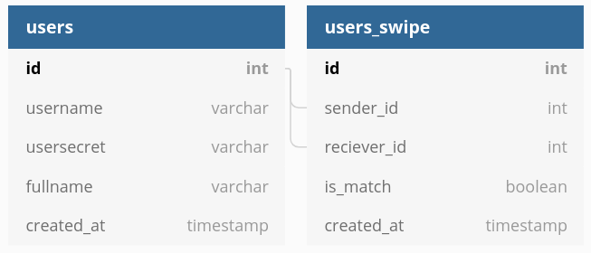

# Database relationships




use [https://dbdiagram.io/d](https://dbdiagram.io/d) and paste the following code

```
Table users as U {
  id int [pk, increment] // auto-increment
  username varchar
  usersecret varchar
  fullname varchar
  gender_id int
  hash varchar
  description varchar
  image_url varchar
  created_at timestamp
  
}

Table genders as G {
  id int [pk, increment] 
  name varchar
}

Table genres as gen {
  id int [pk, increment] 
  name varchar
}

Table user_genres as ugen {
  id int [pk, increment] 
  user_id int
  genre_id int
}


Table users_swipe as us {
  id int [pk, increment]
  sender_id int
  reciever_id int
  is_match boolean
  created_at timestamp
 }

Ref: us.sender_id > U.id
Ref: us.reciever_id > U.id
Ref: U.gender_id > G.id
Ref: ugen.genre_id > gen.id
Ref: ugen.user_id > U.id
```